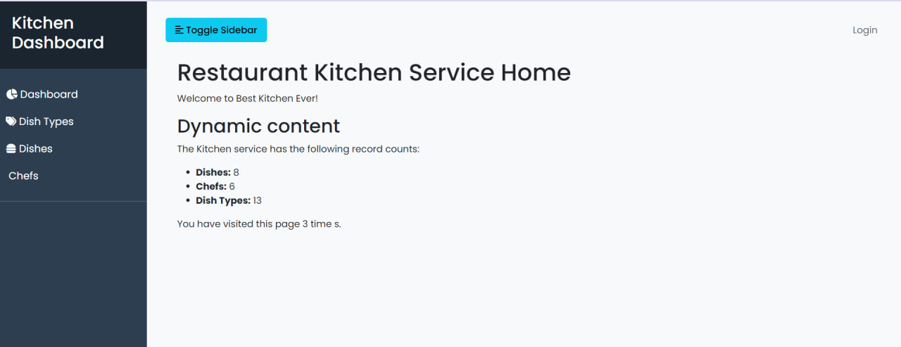
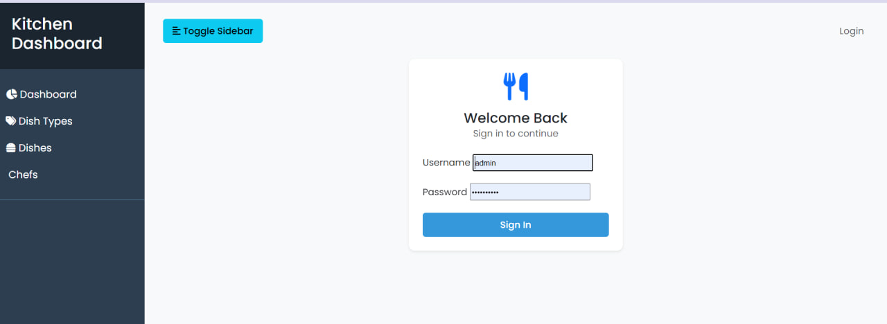
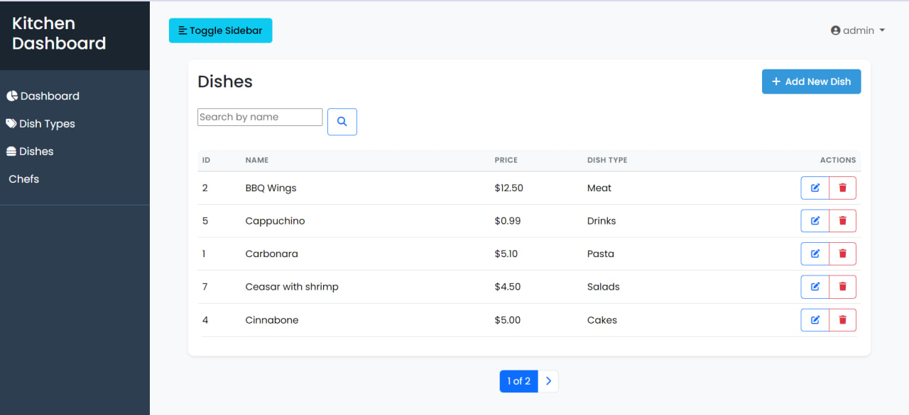

# Restaurant Kitchen Service

The best service system for the restaurant kitchen

# Project Setup

## Environment Variables

This project uses environment variables for configuration. Make sure to set up the following variables in your `.env` file:

- `SECRET_KEY`: Django secret key
- `DEBUG`: Set to True for development, False for production
- `ALLOWED_HOSTS`: Comma-separated list of allowed hosts

Example:
```shell
SECRET_KEY=your_secret_key_here
DEBUG=True
ALLOWED_HOSTS=localhost,127.0.0.1
```

## Installations

Python 3 must be already installed


```shell
git clone https://github.com/Le0n-K/restaurant-kitchen-service.git
cd restaurant-kitchen-service
python -m venv vnv
venv\Scripts\activate
pip install -r requirements.txt
python manage.py runserver
```

## Access to site

login: admin
password: a1d2m3i4n5


## Check it Out!

[Kitchen Service project deployed to Render](https://restaurant-kitchen-service-ejjg.onrender.com)


## Features

* Authentication functionality for Chef/User
* Managing dishes chefs & dish types directly from website interface
* Powerful admin panel for advanced managing

## Demo



